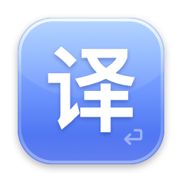
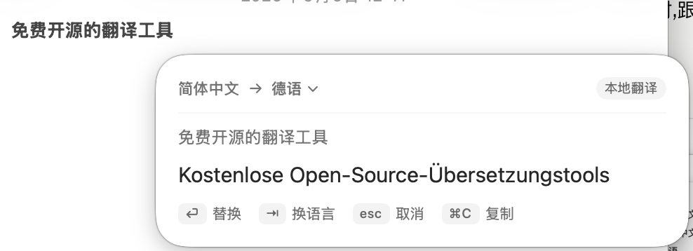
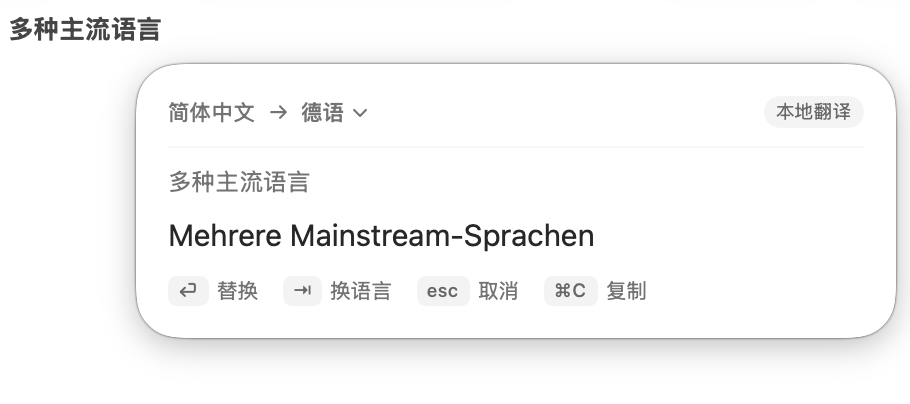
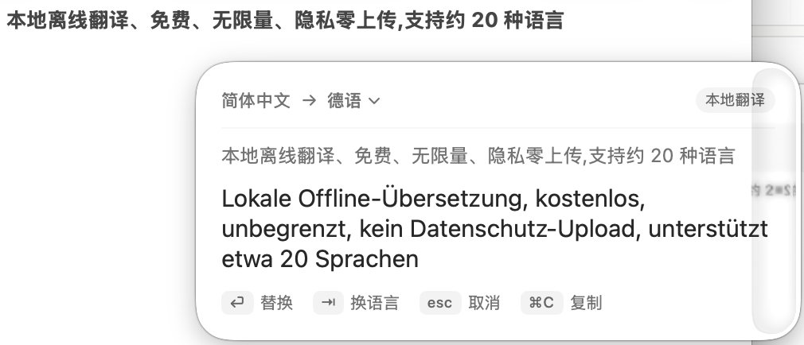
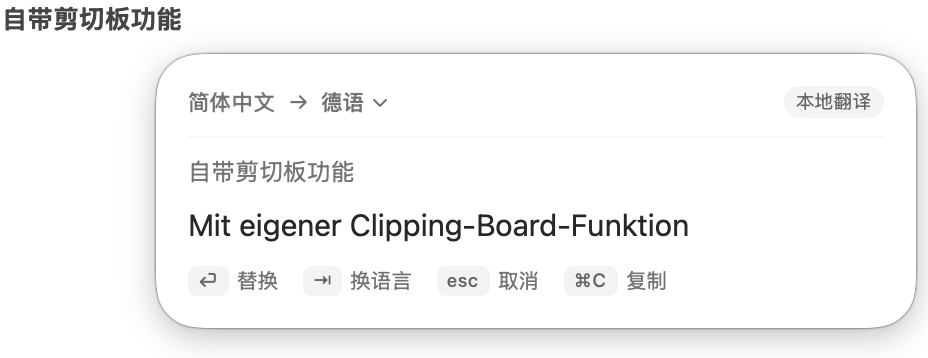

<p align="center">
  
</p>

<h1 align="center">译键 YiJian</h1>

<p align="center">
  输完文字按 <code>⌥⌘T</code>,原地变成另一种语言 —— 任何 App、全程离线。<br>
  Type, hit <code>⌥⌘T</code>, and your text becomes another language — in place, in any app, fully offline.
</p>

<p align="center">
  <a href="#中文">中文</a> · <a href="#english">English</a>
</p>

<table>
  <tr>
    <td></td>
    <td></td>
  </tr>
  <tr>
    <td></td>
    <td></td>
  </tr>
</table>

---

# 中文

## 是什么

译键是一个 macOS 菜单栏小工具,解决一个具体问题:**用外语写东西**。

在微信、邮件、浏览器——任何 App 的输入框里,用你熟悉的语言把话打完,按一下 `⌥⌘T`:光标旁弹出一块玻璃浮窗,译文已经就绪,回车,原文原地替换成外语。不用切窗口、不用复制粘贴、不用改变任何输入习惯。

- **全程本地翻译**:基于 macOS 自带的 Apple Translation 框架,离线可用、免费无限量、内容零上传
- **约 20 种语言**:英、日、韩、法、德、西、意、葡、俄、阿拉伯、泰、越等,浮窗内下拉即选
- **方向全自动**:中文 → 目标语言;检测到外语 → 自动译回中文(母语可设)
- **附赠剪贴板历史**:`⌥⌘V` 呼出最近复制的内容,选一条回车粘贴,还能顺手翻译
- **轻**:无 Dock 图标、空闲零 CPU、内存约 30MB、零第三方依赖

## 安装

本项目以**自行构建**的方式分发(无付费开发者账号做公证;本机构建的 App 不受 Gatekeeper 拦截,反而最省事)。

要求:macOS 26+,Xcode 26(用其命令行工具链)。

```bash
git clone https://github.com/yuchangpeng/yijian-mac.git
cd yijian-mac
make run
```

一条命令完成编译、打包、启动,菜单栏出现  图标即成功。

## 首次设置(两步)

1. **授予辅助功能权限**(取词和回填替换需要):按一次 `⌥⌘T` 触发系统提示,到 系统设置 → 隐私与安全性 → 辅助功能 勾选「译键」。菜单栏图标的菜单里会实时显示权限状态。得益于"稳定启动器"架构(见下文),这个权限**只需授予一次**,以后更新重建都不会失效。
2. **下载语言包**:菜单栏图标 → 设置… → 语言包,下载你需要的语言(如英语)。系统级下载,一次完成,之后彻底离线。

## 使用教程

### 翻译(⌥⌘T)

在任何输入框:

- **没选中文字** → 整个输入框的内容全部翻译、整体替换
- **选中了文字** → 只翻译、只替换选中的部分

浮窗弹出后:

| 按键 | 作用 |
|---|---|
| `⏎` 回车 | 用译文替换原文 |
| `⇥` Tab | 在 目标语 → 备选一 → 备选二 → 母语 之间轮换 |
| 点击语言名(带 ⌄) | 下拉选择全部约 20 种语言,立即重译 |
| `⌘C` | 只复制译文,不替换 |
| `esc` | 取消(点浮窗外部同效) |

几个贴心行为:

- **记住语言**:上次替换/复制时用的目标语言,下次自动优先使用(重启也记得)
- **还原**:翻错了?菜单栏 → 「还原上次替换」一键找回原文
- **自动方向**:打英文按快捷键,会自动译回中文,一键双向
- 微信、VS Code 这类辅助功能接口不完整的 App,会自动用模拟按键兜底,行为一致

### 剪贴板历史(⌥⌘V)

后台自动记录你复制过的文本(最多 50 条,重启不丢)。按 `⌥⌘V` 呼出列表:

| 按键 | 作用 |
|---|---|
| `↑` `↓` | 移动选择 |
| `⏎` 回车 / 点击 | 粘贴选中条目 |
| `1`–`9` | 按序号快速粘贴 |
| `⇥` Tab | **翻译选中条目**(进入翻译浮窗,回车插入译文) |
| `⌘⌫` | 删除选中条目 |
| `esc` | 关闭 |

隐私设计:密码管理器等标记为 concealed/transient 的内容一律不记录;译键自己的临时剪贴板操作也不记录;可在设置中一键关闭或清空,数据只存在本机 `~/Library/Application Support/YiJian/`。

### 设置项速览

菜单栏图标 → 设置…

- **通用**:母语、目标语言 + 两个备选(Tab 轮换序列)、浮窗材质(液态玻璃透明 / 标准 / 磨砂)、开机自启
- **语言包**:查看各语言安装状态、一键下载、跳转系统设置管理
- **剪贴板历史**:开关、清空

## 常见问题

**勾选了辅助功能还是没反应?**
先点菜单栏图标看权限行显示什么。若显示未授予:到系统设置的辅助功能列表,用 **−** 删掉「译键」旧条目,再重新触发授权;或在项目目录执行 `make reset-ax` 后重试。改完建议重启 App(菜单栏 → 退出译键,再 `make run`)。

**提示"语言包未安装"?**
设置 → 语言包 里下载对应语言;或到 系统设置 → 通用 → 语言与地区 → 翻译语言 下载。

**为什么需要辅助功能权限?**
读取输入框文字(取词)和把译文写回去(模拟 ⌘V)都依赖它。译键不联网、不上传任何内容,代码全部开源可查。

**在微信里第一次定位/取词不准?**
这类 App 的无障碍接口默认休眠,首次触发时译键会将其唤醒,第二次起即正常。

**超长文本?**
整段抓取上限 3000 字,更长的请选中后分段翻译。

**⌥⌘V 和 Finder 的"移动项目"冲突?**
已知限制,自定义快捷键在路线图中。

## 权限为什么不会掉:稳定启动器架构

macOS 的辅助功能授权绑定主可执行文件的哈希,普通的无签名开发构建每次重编译都会导致授权失效。译键把 App 拆成两部分:

- `Support/YiJianLauncher` —— 定版启动器(几十 KB),首次构建时在你机器上生成、永不变化,授权锚定在它上面;唯一职责是 dlopen 动态库
- `libYiJianCore.dylib` —— 全部应用逻辑,更新代码只重编译它

于是:授权一次,`make clean`、拉新代码重建、升级 Xcode 都不影响。注意不要手动对 .app 整包 codesign(会改变主执行文件哈希);若修改了启动器源码,执行 `make regen-launcher` 后需重新授权一次。

## 已知限制

- 仅支持 macOS 26+(依赖可直接实例化的 TranslationSession 与新版系统材质)
- 快捷键暂不可自定义
- 语言范围 = 系统本地翻译引擎支持的约 20 种
- 终端类 App(Terminal/iTerm/Warp)与 Finder 出于安全不做整段抓取

## 路线图

- LLM 引擎(Claude / DeepL)+ 语气润色:正式 / 口语 / 简洁
- 多语言并列面板,数字键直选
- 自定义快捷键
- 真输入法模式(打字时候选栏直接出译文)

---

# English

## What is this

YiJian ("translation key", a pun on "one key" in Chinese) is a macOS menu-bar utility that solves one specific problem: **writing in a foreign language**.

In WeChat, Mail, your browser — any app's text field — type in the language you think in, then press `⌥⌘T`. A glass panel pops up next to your caret with the translation ready; press Return and your text is replaced in place. No window switching, no copy-paste round-trips, no changes to your typing habits.

- **100% on-device translation** via Apple's Translation framework: works offline, free, unlimited, nothing ever leaves your Mac
- **~20 languages** — English, Japanese, Korean, French, German, Spanish, Italian, Portuguese, Russian, Arabic, Thai, Vietnamese and more, selectable from a dropdown right in the panel
- **Automatic direction**: native language → target; detected foreign text → back to your native language
- **Bonus clipboard history**: `⌥⌘V` shows your recent copies — paste one with Return, or translate it on the spot
- **Light**: no Dock icon, zero idle CPU, ~30MB RAM, zero third-party dependencies

## Install

Distributed as **build-it-yourself** (no paid Apple Developer account for notarization; a locally-built app has no Gatekeeper issues at all).

Requirements: macOS 26+, Xcode 26 (its command-line toolchain).

```bash
git clone https://github.com/yuchangpeng/yijian-mac.git
cd yijian-mac
make run
```

One command builds, bundles and launches. You're in when the icon appears in your menu bar.

## First-time setup (two steps)

1. **Grant Accessibility permission** (needed to read your text and paste the translation back): press `⌥⌘T` once to trigger the system prompt, then enable "译键" in System Settings → Privacy & Security → Accessibility. Thanks to the stable-launcher architecture (below), you only ever do this **once** — rebuilds never invalidate it.
2. **Download language packs**: menu bar icon → 设置… (Settings) → 语言包 (Language Packs), download the languages you need. System-level download, fully offline afterwards.

## How to use

### Translate (⌥⌘T)

In any text field:

- **Nothing selected** → the whole field is translated and replaced
- **Text selected** → only the selection is translated and replaced

Inside the panel:

| Key | Action |
|---|---|
| `⏎` Return | Replace original text with the translation |
| `⇥` Tab | Cycle target → alternate 1 → alternate 2 → native |
| Click the language name (⌄) | Dropdown with all ~20 languages, retranslates instantly |
| `⌘C` | Copy translation without replacing |
| `esc` | Dismiss (clicking outside works too) |

Nice behaviors: the target language you actually used last time is remembered and used first next time; "还原上次替换" (Revert last replacement) in the menu restores the original if a translation went wrong; typing English and hitting the hotkey translates back to your native language automatically. Apps with poor accessibility support (WeChat, Electron apps) are handled via simulated-keystroke fallback with identical behavior.

### Clipboard history (⌥⌘V)

Text you copy is recorded in the background (up to 50 items, persisted). Press `⌥⌘V`:

| Key | Action |
|---|---|
| `↑` `↓` | Move selection |
| `⏎` / click | Paste the item |
| `1`–`9` | Quick-paste by number |
| `⇥` Tab | **Translate the selected item** (opens the translation panel; Return inserts) |
| `⌘⌫` | Delete the item |
| `esc` | Close |

Privacy by design: content marked concealed/transient (password managers etc.) is never recorded; YiJian's own temporary clipboard operations are excluded; toggle off or clear everything in Settings. Data lives only in `~/Library/Application Support/YiJian/` on your machine.

### Settings overview

Menu bar icon → 设置… — native language, target + two alternates (the Tab cycle), panel material (clear liquid glass / regular / frosted), launch at login, language-pack management, clipboard history toggle & clear.

## FAQ

**Enabled Accessibility but nothing happens?**
Check the permission row in the menu first. If it says not granted: remove the stale "译键" entry in System Settings with **−**, then trigger the prompt again — or run `make reset-ax` and retry. Restart the app afterwards.

**"Language pack not installed"?**
Download it in Settings → Language Packs, or in System Settings → General → Language & Region → Translation Languages.

**Why Accessibility permission?**
Reading the text field and pasting the translation back (synthesized ⌘V) both require it. YiJian makes no network requests; the entire codebase is right here.

**First trigger in WeChat is off?**
Such apps keep their accessibility tree dormant; YiJian wakes it on first use — from the second trigger on it's accurate.

**Long text?** Whole-field grabs cap at 3000 characters; select-and-translate in parts beyond that.

## Why permissions survive rebuilds: the stable-launcher architecture

macOS ties Accessibility grants to the main executable's hash, so ordinary unsigned dev builds lose the grant on every recompile. YiJian splits the app in two:

- `Support/YiJianLauncher` — a frozen ~70KB launcher generated **on your machine** at first build and never touched again; the permission anchors to it; its only job is to dlopen the core library
- `libYiJianCore.dylib` — all application logic; updates only ever recompile this

Result: grant once — `make clean`, pulling updates, even Xcode upgrades don't invalidate it. Don't codesign the .app bundle manually (it rewrites the executable's resource seal and changes the hash). If you edit the launcher source, run `make regen-launcher` and re-grant once.

## Known limitations

- macOS 26+ only (relies on directly instantiable `TranslationSession` and current system materials)
- Hotkeys not yet customizable (`⌥⌘V` shadows Finder's "Move Item Here")
- Language coverage = whatever the system's on-device engine supports (~20)
- Terminals (Terminal/iTerm/Warp) and Finder are excluded from whole-field grabbing for safety

## Roadmap

- LLM engine (Claude / DeepL) with tone control: formal / casual / concise
- Multi-language side-by-side panel with number-key selection
- Custom hotkeys
- True input-method mode (translations directly in the candidate bar as you type)

---

## License / 许可

[PolyForm Noncommercial 1.0.0](LICENSE) © 2026 ChuDu

个人、学习、研究等**非商业用途免费**,可自由使用、修改、分发;**任何商业用途均不允许**,商业授权请联系作者。
Free for **personal and other noncommercial use** — use, modify and share freely. **Commercial use of any kind is not permitted**; contact the author for a commercial license.
